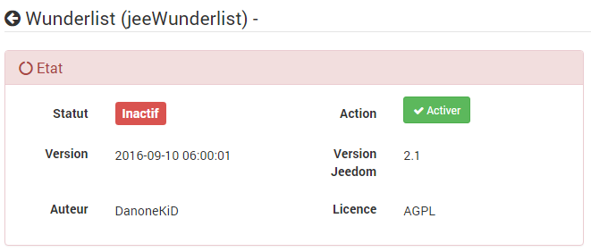
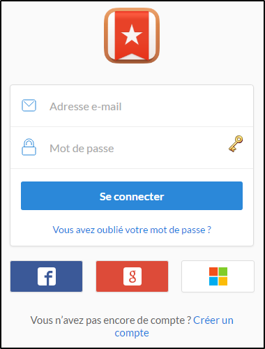
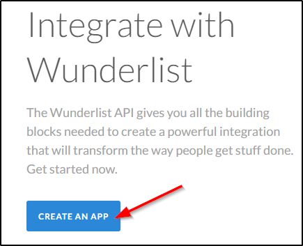
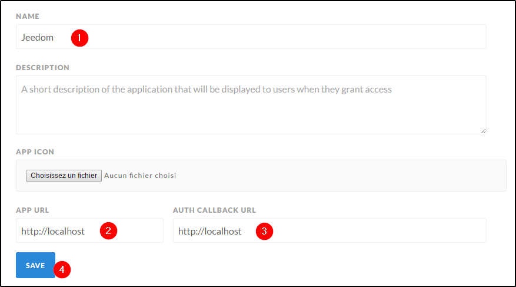
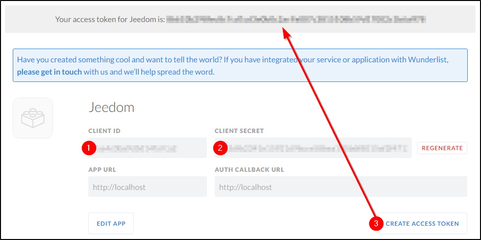
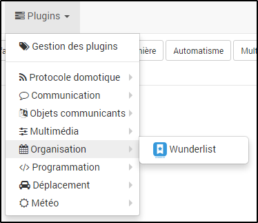
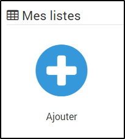
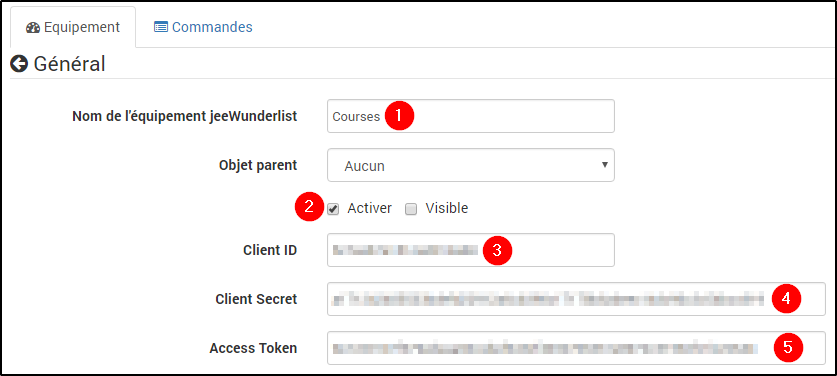
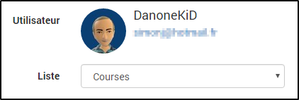
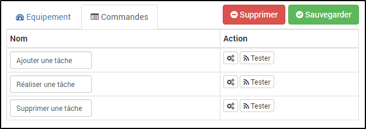

# Configuration

## Configuration du plugin

Après téléchargement du plugin, il faut l’activer, celui-ci ne nécessite aucune autre configuration.

## Configuration de l'API Wunderlist

> **Note**
>
> Pour pouvoir intéragir avec vos listes, il faut au préalable créer une
> "**APP**" sur le site de Wunderlist et obtenir 3 informations qui nous
> serviront pour la suite.

Allez sur <https://developer.wunderlist.com/apps> et connectez-vous avec
votre compte Wunderlist (vous pouvez aussi utiliser **Facebook**,
**Google**ou**Microsoft**).

Vous tombez sur une page ou vous pouvez créer votre **APP**.

1. Le nom de votre APP ex : **Jeedom**

2. Une url quelconque **<http://localhost>**

3. Idem pour l’URL de Callback **<http://localhost>**

4. Cliquez sur **Save**

Vous tombez sur cette page ou il faudra relever le **Client ID**, le
**Client Secret**et générer un**Access Token** en cliquant sur
**Create Access Token**.

## Configuration des équipements

Allez sur la page du plugin : **Plugins**→**Organisation** →
**Wunderlist**

Cliquez sur **Ajouter**

Saisissez un **nom** pour votre liste

1. Le nom de votre liste

2. Activer l’équipement

3. Saisissez le **Client ID** relevé précédemment sur le site
    <https://developer.wunderlist.com/apps>

4. Le **Client Secret**

5. L'**Access Token**

Cliquez ensuite sur **Sauvegarder** pour vous connecter à Wunderlist et
ainsi récupérer vos listes.

Sélectionnez votre liste et re-cliquer sur **Sauvegarder**

Vous avez maintenant à votre disposition 3 commandes Actions que vous
pouvez utiliser dans Jeedom (ex : dans des scénarios).

