# Configuration

## Configuration du plugin
Après téléchargement du plugin, il faut l’activer, celui-ci ne nécessite aucune autre configuration. 

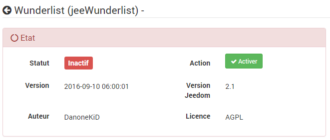

## Configuration de l'API Wunderlist
> **Note**
>
> Pour pouvoir intéragir avec vos listes, il faut au préalable créer une
> "**APP**" sur le site de Wunderlist et obtenir 3 informations qui nous
> serviront pour la suite. 

Allez sur <https://developer.wunderlist.com/apps> et connectez-vous avec
votre compte Wunderlist (vous pouvez aussi utiliser **Facebook**,
**Google** ou **Microsoft**).

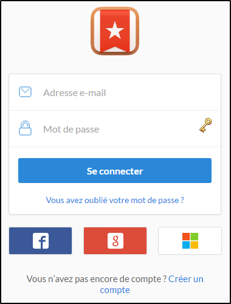

Vous tombez sur une page ou vous pouvez créer votre **APP**.

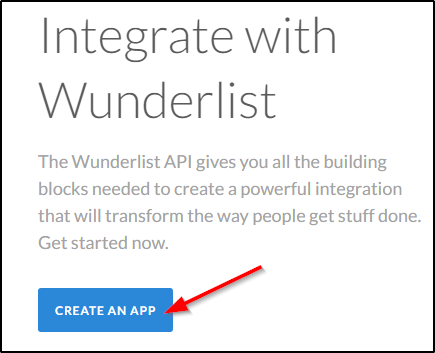

1.  Le nom de votre APP ex : **Jeedom**

2.  Une url quelconque **<http://localhost>**

3.  Idem pour l’URL de Callback **<http://localhost>**

4.  Cliquez sur **Save**

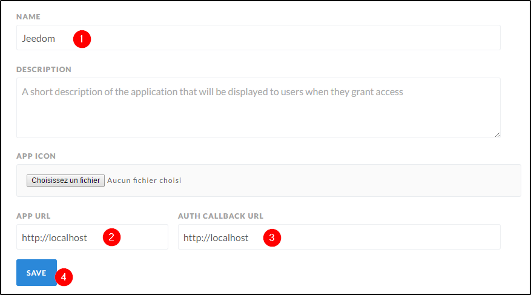

Vous tombez sur cette page ou il faudra relever le **Client ID**, le
**Client Secret** et générer un **Access Token** en cliquant sur
**Create Access Token**.

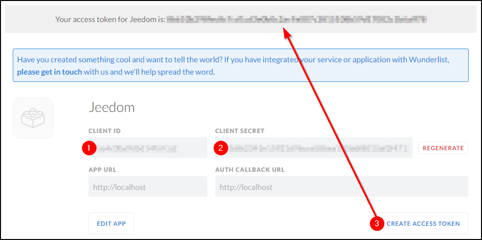

## Configuration des équipements

Allez sur la page du plugin : **Plugins** → **Organisation** →
**Wunderlist**

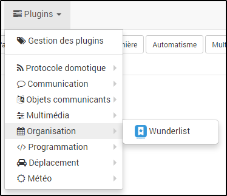

Cliquez sur **Ajouter**

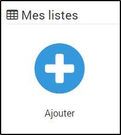

Saisissez un **nom** pour votre liste

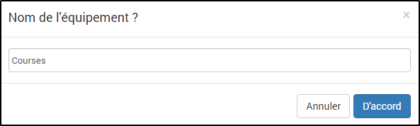

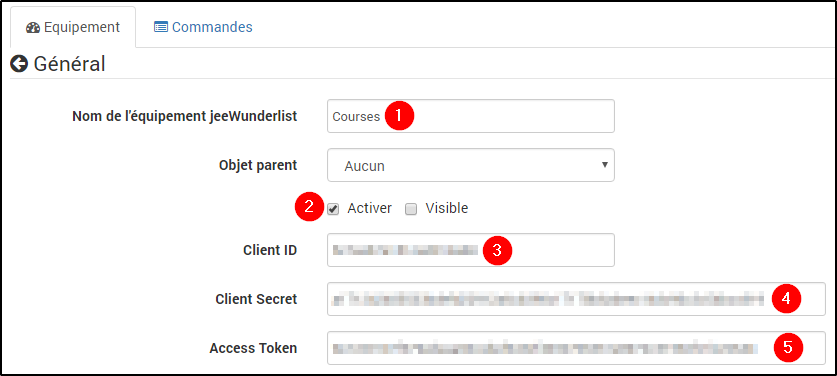

1.  Le nom de votre liste

2.  Activer l’équipement

3.  Saisissez le **Client ID** relevé précédemment sur le site
    <https://developer.wunderlist.com/apps>

4.  Le **Client Secret**

5.  l'**Access Token**

Cliquez ensuite sur **Sauvegarder** pour vous connecter à Wunderlist et
ainsi récupérer vos listes.

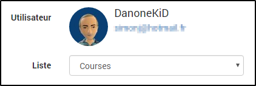

Sélectionnez votre liste et re-cliquer sur **Sauvegarder**

Vous avez maintenant à votre disposition 3 commandes Actions que vous
pouvez utiliser dans Jeedom (ex : dans des scénarios).

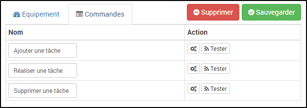